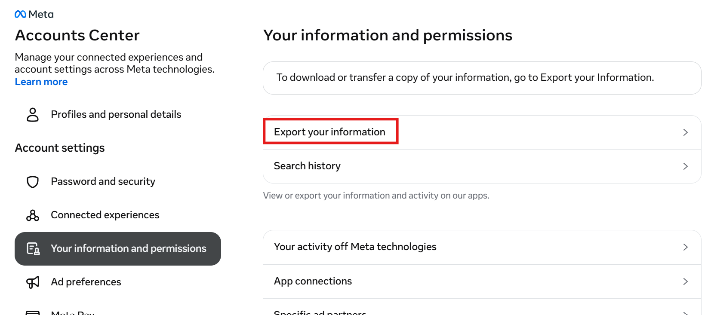
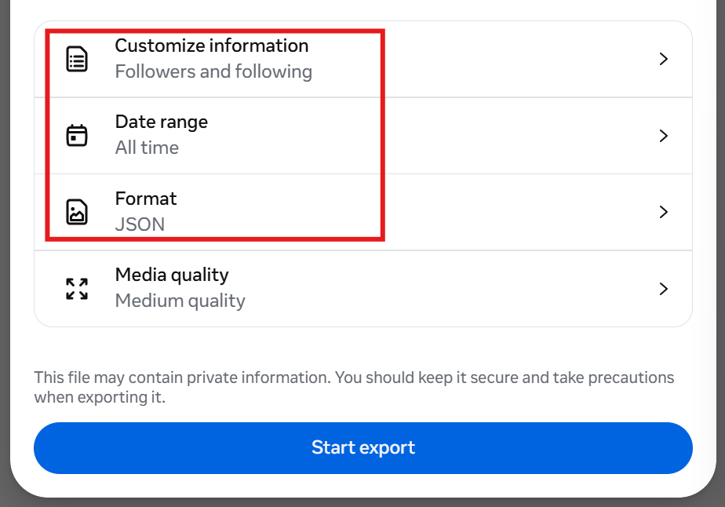
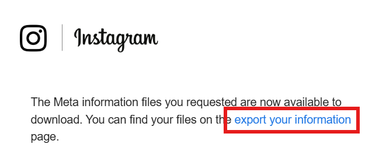
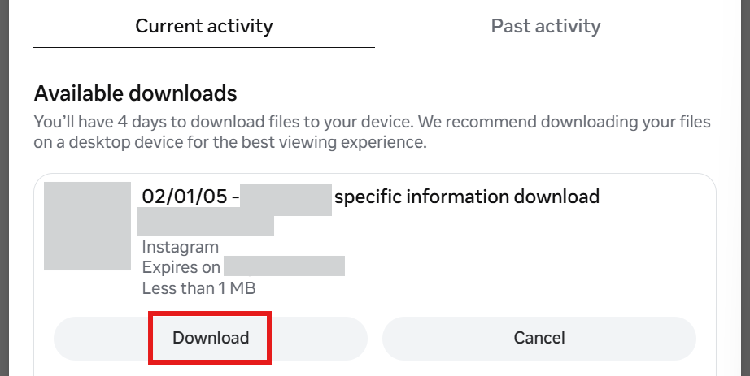
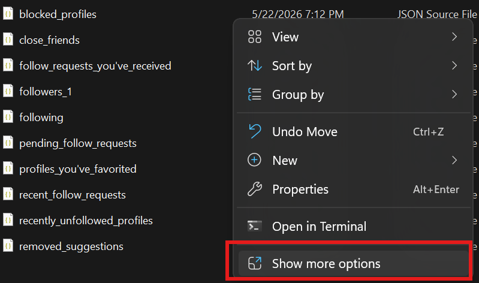
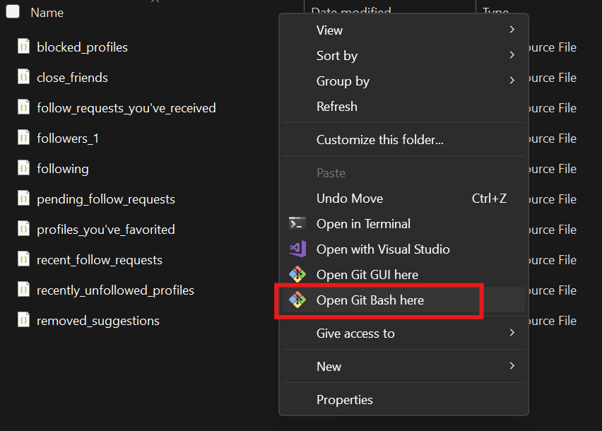

Tutorial for my friends :>

## Overview
Makes a list of Instagram users you are following that don't follow you back.

Basically, we're just getting the lists of your followers and following, cleaning the lists with python, and comparing the lists with computer commands.

#### Notes
This process is not the most technically elegant, as it's meant to be as un-daunting as possible for non-technical users. :p

# Instructions

### Make sure you have the following:

python <a href="https://www.python.org/downloads/">(Python Download)</a>

bash (comes pre-installed on MacOS) <a href="https://gitforwindows.org/">(Git for Windows, which includes Git Bash)</a>

Don't worry if you've never used these! The instructions will show you exactly what you need to do.

## 1. Get Instagram data
### Begin Export
1. Go to <a href="https://accountscenter.instagram.com/">accountscenter.instagram.com</a>

2. Go to "Your information and permissions" and click "Export your information"

    

3. Click "Create export", select your Instagram account, and click "Export to device"

4. Choose the following settings:

    

5. Click "Start export" and enter your password

### Download data
1. After a few minutes you should get an email that looks like this:

    

    Click the link that says "export your information"

2. Download your information

    

3. Unzip the folder that you just downloaded (We'll call this folder MYDATA)

## 2. Clean data
The data will be in MYDATA/connections/followers_and_following. The only files we care about are "followers_1.json" and "following.json"

1. Download "clean.py" from this github repository

    clean.py is a python script that puts the two lists into a format that can be compared with each other

2. Move "clean.py" to MYDATA/connections/followers_and_following

3. Open bash in MYDATA/connections/followers_and_following

    mac: <a href="https://medium.com/@walecloud/add-open-in-terminal-option-for-finder-mac-os-d5ea2b0cde6a">Open Terminal app in this folder</a>, then type *bash* and hit enter

    windows: right click inside the folder in Windows Explorer, click "Show more options", and click "Open Git Bash here"

     

4. Type *python clean.py followers_1.json following.json* and hit enter

    This will create two new files: "sortedfollowers.json" and "sortedfollowing.json"

## 3. Compare lists

# clean.py
